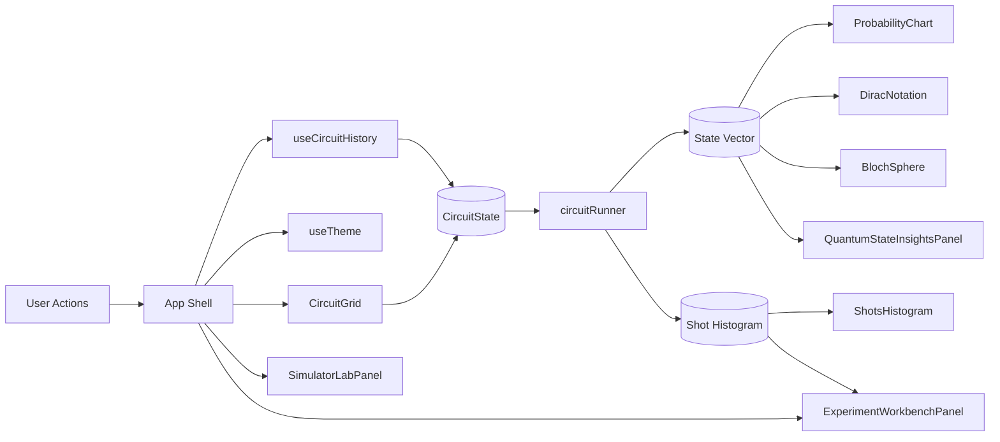
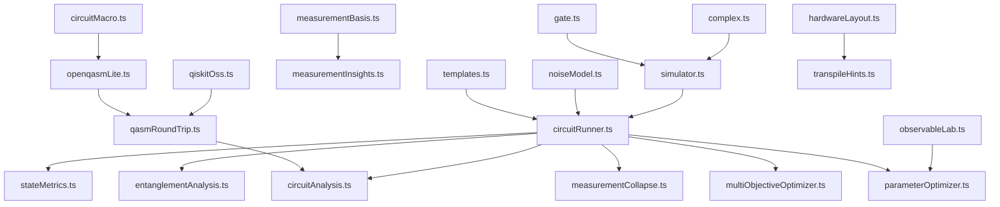
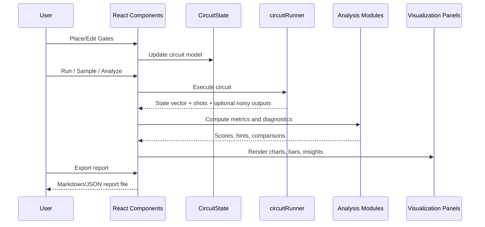

# Quantum Circuit Simulator - Full App Reference

This document is the full reference for application behavior, architecture, modules, and workflows.

Use this together with:
- `README.md` for setup and quick orientation
- `MAINTENANCE.md` for maintenance and release workflows

## 1) Product Scope

The app is a local-first, browser-based quantum circuit simulator focused on:
- Educational circuit construction and exploration
- Deterministic and sampled simulation workflows
- Noise analysis and ideal-vs-noisy comparison
- Engineering-style diagnostics and report export

It runs client-side with no required backend.

## 2) User-Facing UI Map

### 2.1 Global Shell
- Header with app title and global controls.
- Left toolbox/sidebar for gate/template operations.
- Main workspace area for circuit and analysis tabs.

### 2.2 Core Circuit Workspace
- Gate palette and placement controls.
- Circuit grid/canvas for placing, moving, and deleting gates.
- Step cursor and progressive simulation interactions.
- Undo/redo and draft management.

### 2.3 Analysis and Visualization Surfaces
- Probability chart
- Shots histogram
- Dirac notation amplitude/probability views
- Bloch sphere projections
- Circuit metrics and optimization signals
- Quantum state insight cards

### 2.4 Simulator Lab (Advanced)
- Interop tools (OpenQASM import/export and round-trip checks)
- Routing and hardware profile checks
- Parameter optimization and sweep tools
- Noise calibration and mitigation tools
- Benchmark and regression helpers
- Reverse-engineering helper for state prep suggestions

### 2.5 Insights Workspace (Experiment Workbench)
- Operational interpretation notes
- Operational checks and warnings
- Confidence meter
- A/B snapshot comparison
- Professional report export (`.md` / `.json`)
- Inline hover glossary term descriptions

## 3) Runtime Data Model

Primary circuit model:
- `CircuitState`
  - `numQubits`
  - `numColumns`
  - `gates: PlacedGate[]`

Gate model:
- `PlacedGate`
  - `id`
  - `gate`
  - `column`
  - `targets`
  - `controls`
  - `params`
  - optional classical fields for measured/conditional paths

Quantum state model:
- Complex amplitude vectors for pure state simulation.
- Histogram maps for shot-based output distributions.
- Density-matrix utilities for noise/analysis workflows.

## 4) Component Catalog

`src/components/AppHeader.tsx`
- Global top bar controls and shell-level actions.

`src/components/GatePalette.tsx`
- Gate category/group display and drag source.

`src/components/GateTile.tsx`
- Individual gate visual primitive.

`src/components/CircuitGrid.tsx`
- Circuit placement, drag/drop behavior, wire rendering, occupancy checks.

`src/components/GateDetailsPanel.tsx`
- Selected gate details and edit controls.

`src/components/CircuitAnalysisPanel.tsx`
- Circuit metrics and optimization summaries.

`src/components/ProbabilityChart.tsx`
- Bar-chart probability visualization.

`src/components/ShotsHistogram.tsx`
- Histogram visualization of measurement shots.

`src/components/DiracNotation.tsx`
- Basis-amplitude and probability representation.

`src/components/BlochSphere.tsx`
- Per-qubit Bloch visualization.

`src/components/QuantumStateInsightsPanel.tsx`
- State-level diagnostics and qualitative insights.

`src/components/GateDescriptionsModal.tsx`
- Gate glossary/modal reference.

`src/components/SimulatorLabPanel.tsx`
- Advanced experiment and tooling workspace.

`src/components/ExperimentWorkbenchPanel.tsx`
- Confidence, checks, A/B compare, and report export.

`src/components/ErrorBoundary.tsx`
- UI failure boundary and recovery surface.

## 5) Logic Module Catalog

Core simulation and quantum math:
- `src/logic/complex.ts`
- `src/logic/gate.ts`
- `src/logic/simulator.ts`
- `src/logic/circuitRunner.ts`
- `src/logic/densityMatrix.ts`

Circuit structure and editing:
- `src/logic/circuitTypes.ts`
- `src/logic/circuitEditing.ts`
- `src/logic/validation.ts`

Analysis and metrics:
- `src/logic/circuitAnalysis.ts`
- `src/logic/stateMetrics.ts`
- `src/logic/entanglementAnalysis.ts`
- `src/logic/amplitudeAnalysis.ts`
- `src/logic/measurementInsights.ts`
- `src/logic/measurementBasis.ts`
- `src/logic/measurementCollapse.ts`

Templates and descriptions:
- `src/logic/templates.ts`
- `src/logic/gateDescriptions.ts`

Interop and macro systems:
- `src/logic/circuitMacro.ts`
- `src/logic/openqasmLite.ts`
- `src/logic/qiskitOss.ts`
- `src/logic/qasmRoundTrip.ts`
- `src/logic/circuitDiff.ts`
- `src/logic/symbolBindings.ts`

Noise and mitigation:
- `src/logic/noiseModel.ts`
- `src/logic/noiseCalibration.ts`
- `src/logic/readoutMitigation.ts`

Optimization and hardware-aware logic:
- `src/logic/parameterOptimizer.ts`
- `src/logic/multiObjectiveOptimizer.ts`
- `src/logic/hardwareProfiles.ts`
- `src/logic/hardwareLayout.ts`
- `src/logic/transpileHints.ts`

Benchmarks and reverse engineering:
- `src/logic/benchmarkSuites.ts`
- `src/logic/reverseEngineering.ts`

UI utility helpers:
- `src/logic/chartDomains.ts`
- `src/logic/constants.ts`
- `src/logic/observableLab.ts`

## 6) Hooks and Shared UI State

`src/hooks/useCircuitHistory.ts`
- Undo/redo timeline and state transitions.

`src/hooks/useTheme.ts`
- Theme mode behavior and persisted preference.

## 7) Persistence and Local Data

Persisted categories may include:
- Theme preference
- Circuit drafts and active draft identity
- Certain advanced workspace/session artifacts (where applicable)

No cloud persistence is required for core use.

## 8) Testing Topology

Test suites are in `src/logic/*.test.ts` and grouped by behavior class.

Core and correctness:
- `complex.test.ts`
- `simulator.test.ts`
- `circuitRunner.test.ts`

Template and pipeline:
- `templates.test.ts`
- `templatePipelineRobustness.test.ts`

Cross-feature and utility coverage:
- `featureAccuracy.test.ts`
- `utilitiesCoverage.test.ts`

Interop/parsing/transpile:
- `interopRobustness.test.ts`
- `qiskitOssInterop.test.ts`

Optimization/routing:
- `optimizationAndRoutingRobustness.test.ts`

Initialization and collapse:
- `stateInitializationRobustness.test.ts`

Reverse-engineering and benchmarks:
- `reverseEngineeringAndBenchmark.test.ts`

Property/fuzz invariants (seeded deterministic):
- `propertyFuzzRobustness.test.ts`

Noise mitigation behavior:
- `readoutMitigation.test.ts`

Circuit editing constraints:
- `circuitEditing.test.ts`

## 9) Commands and Workflows

Install:
- `npm install`

Run dev:
- `npm run dev`

Lint:
- `npm run lint`

Tests (single run):
- `npm test -- --run`

Build:
- `npm run build`

Preview build:
- `npm run preview`

Recommended pre-merge gate:
1. `npm run lint`
2. `npm test -- --run`
3. `npm run build`

## 10) Styling and Design Conventions

Global styling is centered in `src/App.css`.

Conventions:
- Shared visual tokens via CSS custom properties.
- Bar/progress visuals should keep consistent thickness and track behavior within a panel.
- Panel-local class prefixes (for example `wb-` for workbench, `sim-lab-` for simulator lab).

## 11) Constraints and Limits

- State-vector simulation cost scales exponentially with qubit count.
- Certain matrix/unitary and advanced analyses are intentionally practical-bound in UI.
- Some interop pathways support a practical subset of external formats (for example OpenQASM-lite import).

## 12) Known Sensitive Areas

- OpenQASM parser capture groups in `openqasmLite.ts` (parameterized gate parsing is easy to break).
- Symbol regex handling in `symbolBindings.ts` (must escape symbol names).
- Multi-qubit ordering conventions in simulation paths (controls/targets correctness).
- LSB indexing consistency for basis-string/qubit mapping logic.

## 13) Documentation Governance

When adding/changing features:
1. Update `README.md` user-facing feature bullets if user-visible behavior changed.
2. Update this file (`APP_REFERENCE.md`) if module map, panels, or data flow changed.
3. Update `MAINTENANCE.md` if build/release/test workflows or critical invariants changed.

The objective is to keep three layers synchronized:
- Quick start (`README.md`)
- Full reference (`APP_REFERENCE.md`)
- Operational maintenance (`MAINTENANCE.md`)

## 14) Architecture Diagrams

### 14.1 UI State and Interaction Flow

### 14.2 Logic Module Dependency Map

### 14.3 Runtime Data Lifecycle

